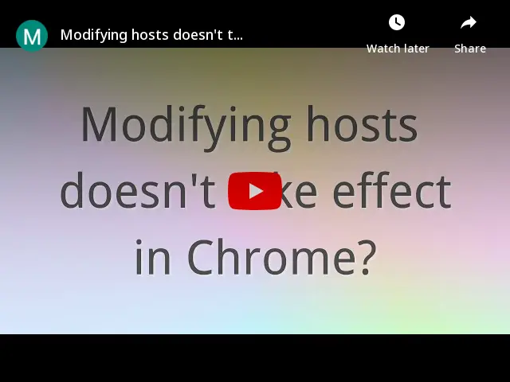

# close-sockets-chrome-extension

English | [简体中文](./README.zh-CN.md)

Close all sockets with only a single click.

## Install

**Note**: This extension needs to execute script in `chrome://net-internals/#sockets`. **Please make sure `Extensions on chrome:// URLs` enabled as step 3 to 4** to make this extension work.

1. Clone this repository
2. Go to chrome://extensions/, click `Load unpacked` and select the cloned repository
3. Open chrome://flags/#extensions-on-chrome-urls
4. Select `Enabled`.

## Usage

Click the extension icon  , then this extension can help you:

1. Open chrome://net-internals/#sockets;
2. Click `Close idle sockets` button;
3. Click `Flush socket pools` button;
4. Close tab opened in step 1.
5. Refresh the original tab you were on.

You can also configure a keyboard shortcut by going to chrome://extensions/shortcuts.
